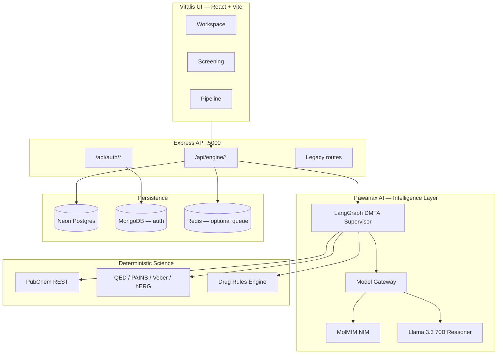
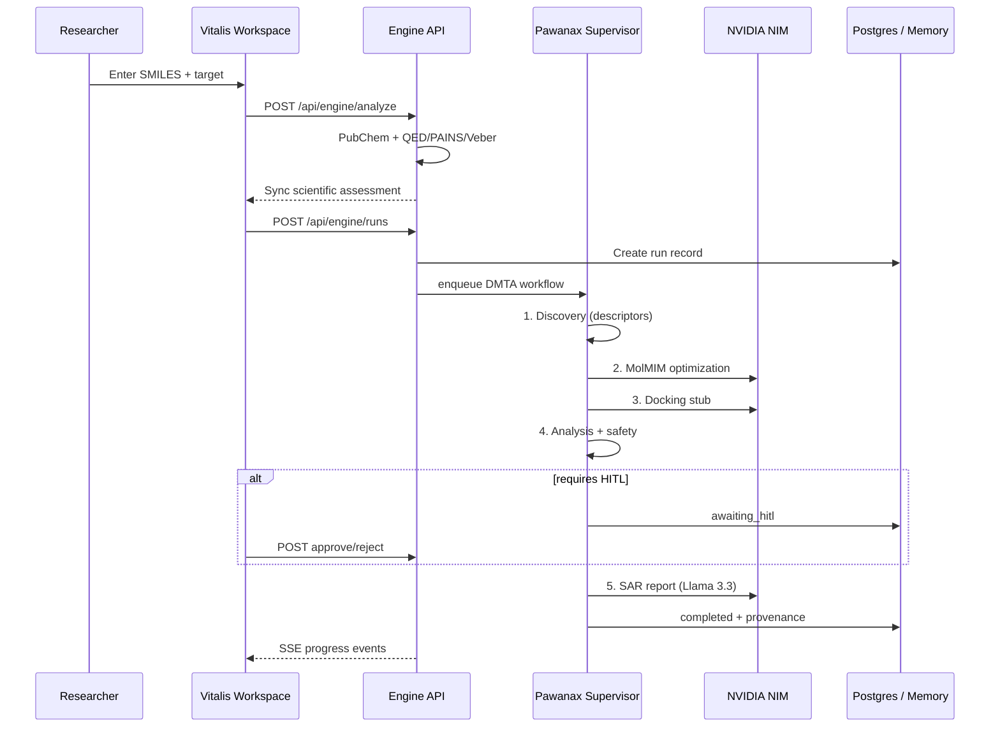
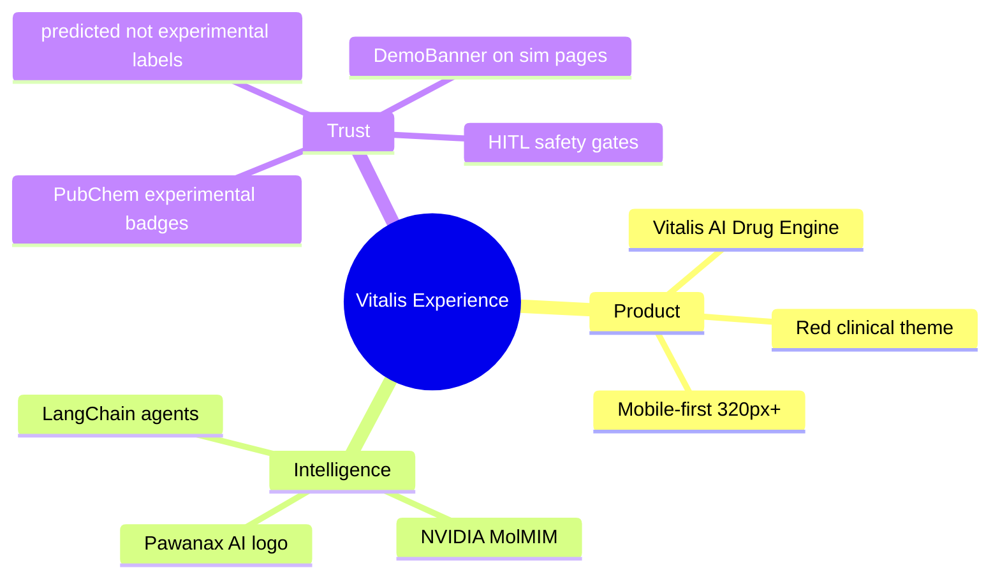
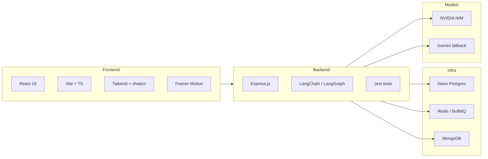
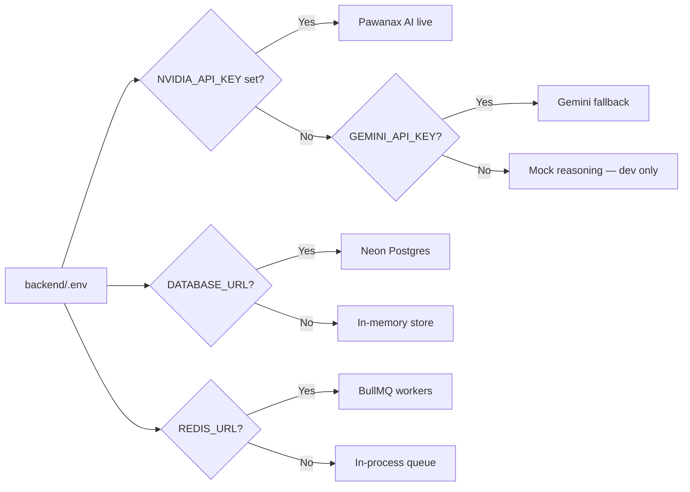
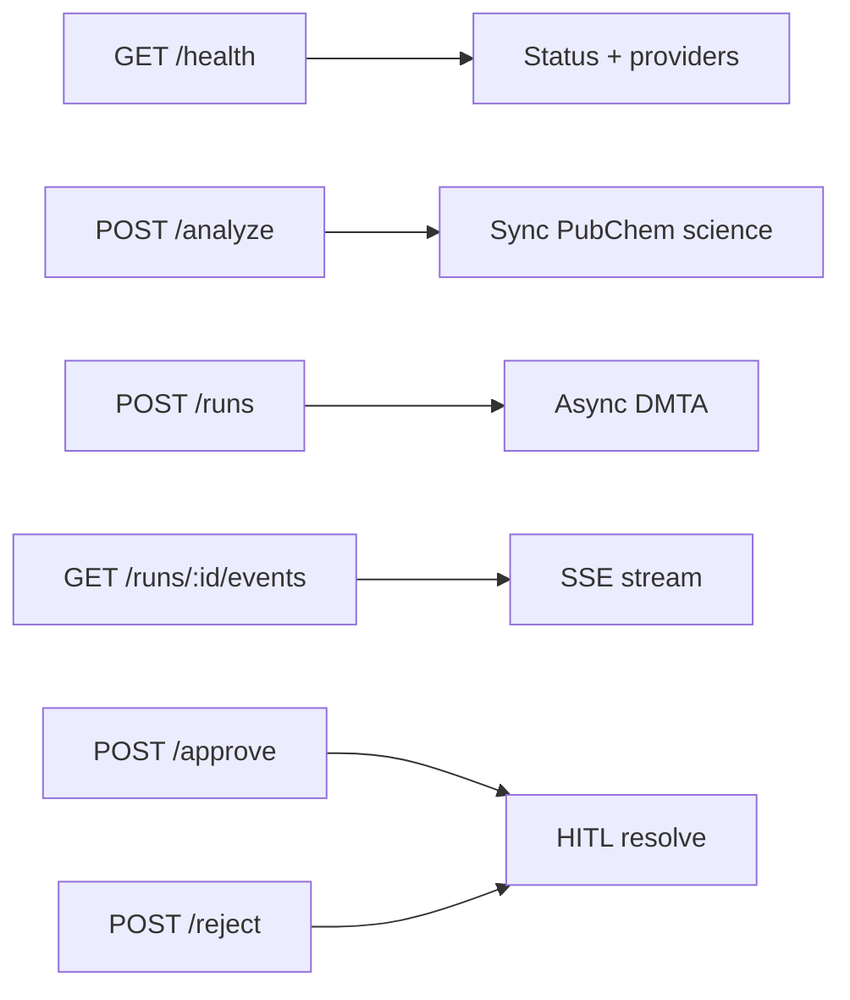
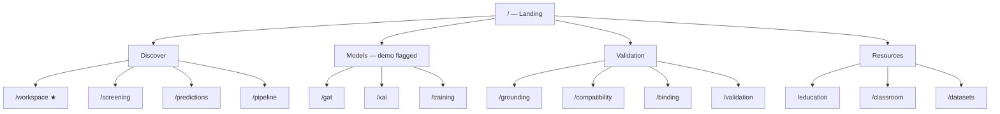
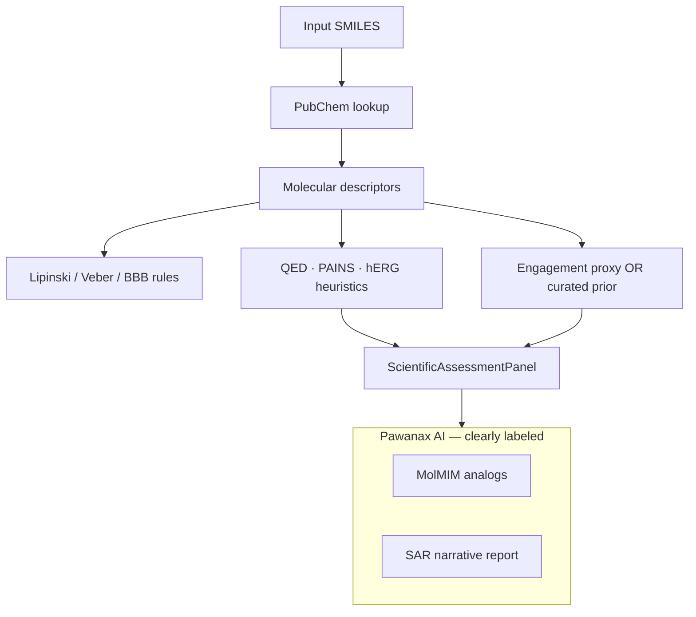
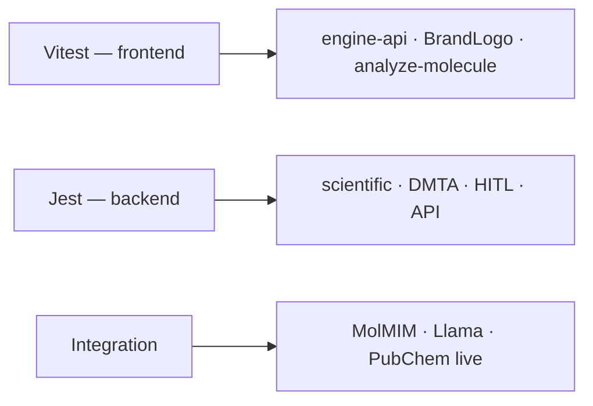

<p align="center">
  
</p>

<h1 align="center">Vitalis AI Drug Engine</h1>
<p align="center"><strong>Research-grade in-silico drug discovery — powered by <em>Pawanax AI</em></strong></p>

<p align="center">
  <a href="#quick-start">Quick Start</a> ·
  <a href="#architecture">Architecture</a> ·
  <a href="#environment-variables">Environment</a> ·
  <a href="#routes">Routes</a> ·
  <a href="ENGINE.md">Engine Status</a>
</p>

---

## What you are looking at

When you open this repository, you will find **two names that work together**:

| Name | Role | Think of it as… |
|------|------|-----------------|
| **Vitalis AI Drug Engine** | The **product** — workflows, UI, DMTA pipeline, persistence | The laboratory instrument |
| **Pawanax AI** | The **intelligence** — NVIDIA NIM, LangChain agents, reasoning | The scientist operating the instrument |

The red **Pawanax** logo marks the AI layer. **Vitalis** is the engine researchers interact with daily.

---

## Mission

Traditional drug discovery takes 10+ years and billions of dollars. **Vitalis AI Drug Engine** compresses the *Design → Make → Test → Analyze* (DMTA) loop into hours of in-silico work — with **honest uncertainty labels**, PubChem-validated descriptors, and human-in-the-loop (HITL) safety gates before any high-risk recommendation proceeds.

Built for researchers, educators, and teams focused on diseases that disproportionately affect underserved populations (malaria, TB, sickle cell, NTDs).

---

## System overview



---

## DMTA workflow (what happens when you click Analyze)



---

## Brand & design system



| Token | Value | Usage |
|-------|-------|-------|
| `--primary` | `357 78% 52%` | Pawanax red — CTAs, active nav |
| `--foreground` | `0 5% 92%` | Neutral lab grey text |
| `--background` | `220 20% 4%` | Dark research shell |
| Touch targets | `min 44px` | Mobile `.touch-target` utility |

**Fonts:** Space Grotesk (UI) · JetBrains Mono (data, SMILES, provenance)

---

## Tech stack



| Layer | Technology | You configure it in… |
|-------|------------|----------------------|
| Web app | React 18, Vite, TypeScript, pnpm | `package.json`, `vite.config.ts` |
| UI kit | shadcn/ui, Tailwind, Framer Motion | `src/index.css`, `tailwind.config.ts` |
| API | Express 4, CommonJS | `backend/src/index.js` |
| Orchestration | LangGraph DMTA supervisor | `backend/src/engine/orchestrator/` |
| Models | NVIDIA NIM (Pawanax), Gemini fallback | `backend/.env` |
| Persistence | Neon Postgres + in-memory fallback | `DATABASE_URL` |
| Queue | BullMQ + in-process fallback | `REDIS_URL` |
| Auth (legacy) | MongoDB + JWT | `MONGODB_URI` |

---

## Quick start

When you clone this repo, follow these steps in order. Each step builds on the previous one.

### Prerequisites

- **Node.js 18+**
- **pnpm 10+** (`corepack enable && corepack prepare pnpm@latest --activate`)
- Optional: MongoDB (auth), Postgres (Neon), Redis, NVIDIA API key

### 1. Install dependencies

```bash
pnpm install
```

### 2. Configure secrets

```bash
cp backend/.env.example backend/.env
```

Open `backend/.env` and set at minimum:

```env
NVIDIA_API_KEY=nvapi-...          # Pawanax AI — MolMIM + reasoning
DATABASE_URL=postgresql://...     # Optional — falls back to in-memory
```

See [Environment variables](#environment-variables) for the full reference.

### 3. Run migrations (when Postgres is configured)

```bash
pnpm db:migrate
```

### 4. Start development servers

```bash
pnpm dev
```

| Service | URL | What you will see |
|---------|-----|-------------------|
| **Vitalis UI** | http://localhost:8080 | Landing, Workspace, Screening |
| **Engine API** | http://localhost:5000 | `/api/engine/health` |

### 5. Verify everything works

```bash
pnpm test                    # Unit tests (frontend + backend)
pnpm test:integration        # NVIDIA live tests (requires NVIDIA_API_KEY)
pnpm build                   # Production build
```

---

## Environment variables

### Frontend (`vite` — optional)

Create `.env.local` at repo root if you need a non-default API host:

```env
VITE_API_URL=http://localhost:5000
```

### Backend (`backend/.env`) — complete reference

| Variable | Required | Default | Purpose |
|----------|----------|---------|---------|
| `PORT` | No | `5000` | Express listen port |
| `NODE_ENV` | No | `development` | `test` skips Mongo auto-connect |
| `CORS_ORIGIN` | No | `http://localhost:8080` | Allowed browser origin |
| `FRONTEND_URL` | No | `http://localhost:8080` | Redirect / email links |
| `MONGODB_URI` | For auth | `mongodb://localhost:27017/vitalis-ai` | User accounts, subscriptions |
| `DATABASE_URL` | Recommended | — | Neon Postgres for runs, provenance, HITL |
| `REDIS_URL` | Optional | — | BullMQ async jobs; in-process if unset |
| `NVIDIA_API_KEY` | **For Pawanax AI** | — | MolMIM, Llama, docking stub |
| `NVIDIA_BASE_URL` | No | `https://integrate.api.nvidia.com/v1` | Chat completions |
| `NVIDIA_REASONING_MODEL` | No | `meta/llama-3.3-70b-instruct` | SAR reports, agent reasoning |
| `NVIDIA_CHAT_MODEL` | No | `meta/llama-3.1-8b-instruct` | Fast chat / tool calls |
| `NVIDIA_MOLMIM_URL` | No | `https://health.api.nvidia.com/v1/biology/nvidia/molmim/generate` | Lead optimization |
| `GEMINI_API_KEY` | Fallback | — | Used when NVIDIA key absent |
| `GEMINI_MODEL` | No | `gemini-2.5-flash-lite` | Gemini model id |
| `ENGINE_REQUIRE_AUTH` | No | `false` | Gate engine routes behind JWT |
| `DEFAULT_MODEL_PROVIDER` | No | `nvidia` | `nvidia` \| `gemini` \| mock |
| `JWT_SECRET` | Production | — | Sign auth tokens |
| `STRIPE_SECRET_KEY` | Billing | — | Subscription payments |
| `STRIPE_WEBHOOK_SECRET` | Billing | — | Stripe webhooks |



> **Security:** Never commit `.env` files. Rotate keys if exposed. CI uses ephemeral Postgres — not your production Neon branch.

---

## Engine API (Pawanax-powered)



| Method | Path | Returns |
|--------|------|---------|
| `GET` | `/api/engine/health` | DB, queue, model provider status |
| `POST` | `/api/engine/analyze` | `{ success, analysis, provenance }` |
| `POST` | `/api/engine/runs` | `{ runId, eventsUrl }` — 202 Accepted |
| `GET` | `/api/engine/runs/:id` | Run status + step outputs |
| `GET` | `/api/engine/runs/:id/events` | Server-Sent Events stream |
| `POST` | `/api/engine/runs/:id/approve` | HITL approve → `completed` |
| `POST` | `/api/engine/runs/:id/reject` | HITL reject → `cancelled` |

Frontend client: `src/lib/engine-api.ts` · Unified analysis entry: `src/lib/analyze-molecule.ts`

---

## Routes map



| Route | Purpose | Data honesty |
|-------|---------|--------------|
| `/workspace` | **Primary researcher surface** — DMTA + scientific panel | PubChem + engine |
| `/screening` | Batch SMILES screening | Engine-first via `analyzeMoleculeUnified` |
| `/predictions` | Lipinski / Veber / ADMET scoring | Rule-based + PubChem |
| `/pipeline` | 8-stage discovery timeline | Educational |
| `/xai`, `/gat`, `/training` | Demos / simulators | **DemoBanner** — not production models |
| `/login`, `/signup` | Auth | MongoDB backend |

---

## Project structure (where to edit what)

```
.
├── public/pawanax-logo.png      ← Pawanax AI brand mark
├── src/
│   ├── components/
│   │   ├── BrandLogo.tsx        ← Vitalis product + Pawanax AI subline
│   │   ├── workspace/           ← WorkspaceAnalyzer, EngineProgress, ScientificAssessmentPanel
│   │   └── DemoBanner.tsx       ← Trust disclaimer for demo pages
│   ├── lib/
│   │   ├── analyze-molecule.ts  ← ★ Single analysis entry (engine → fallback)
│   │   └── engine-api.ts        ← Engine REST + SSE client
│   └── pages/                   ← Route-level views
├── backend/src/engine/          ← ★ Pawanax-powered DMTA core
│   ├── orchestrator/supervisor.js
│   ├── analysis/scientific-assessment.js
│   ├── tools/molmim-tool.js
│   └── models/gateway.js
├── ENGINE.md                    ← Honest implementation scorecard
└── pnpm-workspace.yaml
```

**When you add a new analysis feature:** extend `backend/src/engine/analysis/` first, expose via `/api/engine/analyze`, then wire `analyze-molecule.ts` — not a new client-side pipeline.

---

## Scientific pipeline (deterministic vs AI)



Every score carries **source**, **confidence**, and **disclaimer** fields. The UI never implies experimental Ki/IC50 unless sourced from literature priors.

---

## Mobile-first UX

The Vitalis workspace is designed **phone-up**:

- **320px minimum** — hero type scales with `clamp()`, property grids collapse to 2 columns
- **44px touch targets** — `.touch-target` on nav, buttons, analyzer controls
- **Mobile nav** — backdrop overlay, body scroll lock, sign-in/sign-up in drawer
- **Safe areas** — `.safe-top` / `.safe-bottom` for notched devices

Test on real hardware: iPhone SE (375×667) and a 320px emulator.

---

## UI/UX scorecard (Genius-Artist audit)

| Dimension | Score | Notes |
|-----------|-------|-------|
| Branding clarity | **8/10** | Vitalis = product, Pawanax = AI — now explicit |
| Mobile experience | **7.5/10** | Touch targets, drawer auth; tables on Screening need scroll |
| Navigation | **7.5/10** | 16 routes — consider Quick Start strip |
| Workspace UX | **7.5/10** | Scientific panel + SSE progress |
| Typography | **6.5/10** | Consider serif for assessment panels |
| Trust / credibility | **8/10** | Honest badges, HITL, demo quarantine |

**Overall: ~7.5/10** — research-ready; path to 9+ is nav simplification + responsive table audit.

---

## Testing

```bash
pnpm test                 # 21+ unit tests
pnpm test:integration     # NVIDIA live (5 tests) — requires NVIDIA_API_KEY
pnpm build                # Vite production bundle
```



---

## Deployment checklist

When you ship to production, verify each item:

- [ ] `NVIDIA_API_KEY` set in host environment (Pawanax AI live)
- [ ] `DATABASE_URL` → Neon Postgres (+ run `pnpm db:migrate`)
- [ ] `REDIS_URL` for horizontal job workers
- [ ] `JWT_SECRET` rotated from default
- [ ] `CORS_ORIGIN` / `FRONTEND_URL` match deployed domain
- [ ] `pnpm build` → serve `dist/` via CDN or static host
- [ ] API on `:5000` or reverse-proxied at `/api`

---

## Contributing (for the next engineer)

You will succeed fastest if you internalize this order:

1. **Read `ENGINE.md`** — honest gap list, no surprises
2. **Run `pnpm dev` + open `/workspace`** — feel the DMTA loop
3. **Trace one SMILES** from `WorkspaceAnalyzer` → `analyze-molecule.ts` → `/api/engine/analyze` → `molecule-analyzer.js`
4. **Change science in `backend/src/engine/`** — not in deprecated client pipelines
5. **Add tests** beside existing `backend/test/engine*.test.js` files
6. **Keep branding**: Vitalis = engine, Pawanax = AI

---

## License & credits

- **License:** Apache 2.0
- **Engine:** Vitalis AI Drug Engine
- **Intelligence:** Pawanax AI (NVIDIA NIM + LangChain)
- **Hackathon origin:** Vitalis AI Drug Discovery Hackathon 2026

---

<p align="center">
  
  <br />
  <em>Vitalis AI Drug Engine · Powered by Pawanax AI</em>
  <br />
  <strong>Last updated:</strong> June 2026 · <strong>Version:</strong> 3.0.0
</p>
